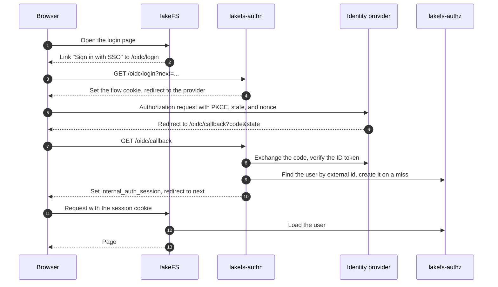
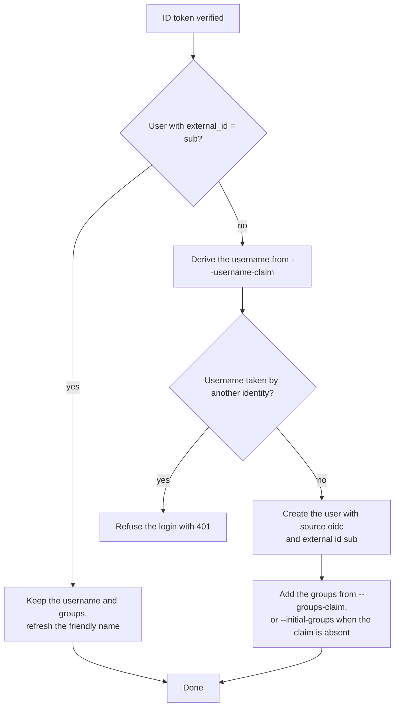
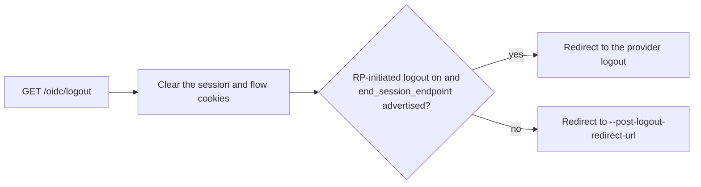
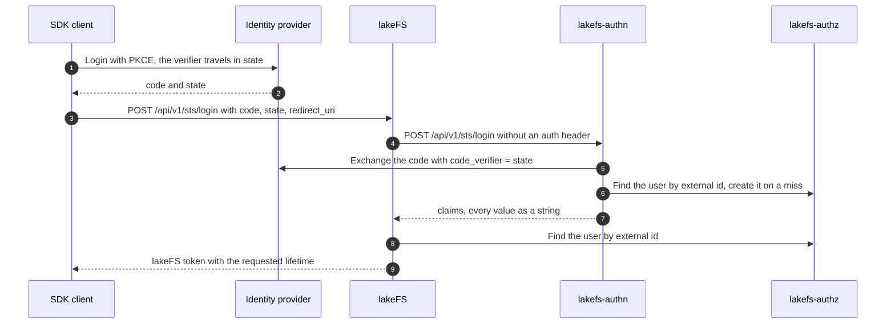

# Authentication flows

lakefs-authn implements the lakeFS authentication API and the browser side of the OIDC login. lakeFS never talks
OIDC itself. It reads a session cookie for browsers and calls lakefs-authn for the STS code exchange.

## Browser login

The callback checks three things before it creates a session:

- `state` matches the flow cookie. The comparison runs in constant time.
- The code exchange uses the PKCE verifier from the flow cookie.
- The ID token has a valid signature, issuer, audience, expiry, and nonce.

The session cookie holds a lakeFS login token. lakefs-authn signs it with the shared secret in the format lakeFS
uses, so lakeFS verifies it without a call back. The flow cookie lives 10 minutes. The session lives
`--session-ttl`, 7 days by default.

## User provisioning

Every login resolves to one lakeFS user:

The server never binds an existing account to a new identity. With `--auto-provision false` the "no" branch
refuses the login instead of creating a user, so every account must exist before its first login. A group
assignment that fails after the create deletes the user again, so the next login retries the whole create.

## Logout

The provider logout receives the client id, the post-logout redirect URI, and the ID token hint.

## SDK login with an identity provider code

A program can log in without a browser session through the lakeFS operation `POST /api/v1/sts/login`. lakeFS
names it after the AWS Security Token Service, because it trades an identity provider code for a lakeFS token.
The lakeFS SDKs implement it: `lakefs.client.from_web_identity(code, state, redirect_uri, ttl_seconds)` in
Python, and `stsLogin` in the experimental API of the Java and Rust clients. lakectl does not use it.

The SDK runs the OIDC login itself and receives an authorization code from the identity provider. It posts the
code to lakeFS, lakeFS forwards it to lakefs-authn, and the SDK receives a lakeFS token with the requested
lifetime. From then on the SDK calls lakeFS with that token, as it would with an access key. lakefs-authn
redeems the code only when the `redirect_uri` is on `--sts-allowed-redirect-uris`; the list is empty by
default, so the SDK login is off until the operator lists the redirect URIs of the SDK clients.

## Deployment

Browsers scope cookies by host. lakefs-authn must answer on the lakeFS host under the `/oidc/` prefix, usually
through a reverse proxy rule. The [Docker](installation/docker.md#3-reverse-proxy) and
[Helm](installation/helm.md#2-install-the-chart) pages show it. A local setup with lakeFS on port 8000 and lakefs-authn on port 8001 needs no proxy, because ports do
not isolate cookies.

Set `--oidc-issuer` to the exact issuer the provider advertises. Discovery fails on any difference, including a
trailing slash.
