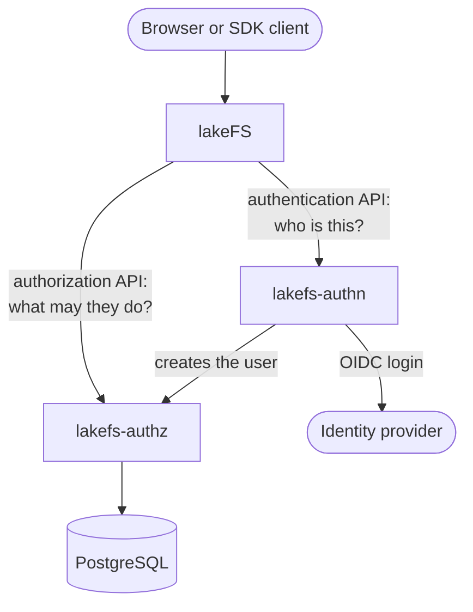

# lakefs-auth

Two Rust servers give open-source [lakeFS](https://lakefs.io) multi-user RBAC and OIDC single sign-on.

- **lakefs-authz** stores users, groups, policies, and access keys in PostgreSQL. lakeFS reads them through its
  authorization API and evaluates the policies itself.
- **lakefs-authn** runs the OIDC login in the browser, creates the user in lakefs-authz, and gives lakeFS a
  session cookie. It also serves the token login that the lakeFS SDKs use.

Open-source lakeFS ships the clients for both APIs but no server. Without these servers it stores one user only.

## How the parts connect

Every client talks to lakeFS, and lakeFS asks the two servers:

The browser login is the one path that leaves this shape. The browser opens `/oidc/login` and `/oidc/callback`
on the lakeFS host, and the reverse proxy sends that prefix to lakefs-authn. See
[Authentication flows](authn-flows.md).

One secret ties the three servers together: lakeFS `auth.encrypt.secret_key`. See [Secrets](installation/secrets.md).

## Pages

- [Installation](installation/index.md): what every setup needs, the secrets, Docker Compose or the Helm chart,
  the bootstrap file that seeds roles, and the hardened container images.
- [Operations](operations.md): health checks, logs, timeouts and caching, the database, and restarts.
- [Authentication flows](authn-flows.md): browser login, user provisioning, logout, and the STS login.
- Reference: set up and configure [lakefs-authn](reference/lakefs-authn.md) and
  [lakefs-authz](reference/lakefs-authz.md).

## Try it

The [repository](https://github.com/ion-elgreco/lakefs-auth) has a compose demo with lakeFS, both servers,
PostgreSQL, RustFS as the S3 object store, and ferriskey as the identity provider. Run `just demo-up` from a
checkout, then log in as `user` / `user`.
