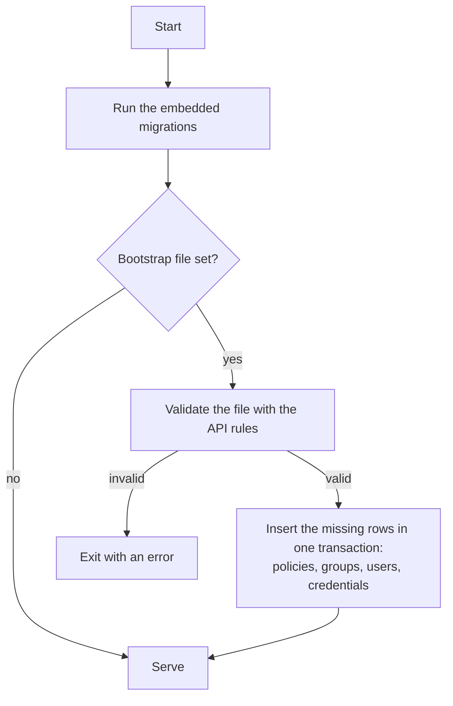
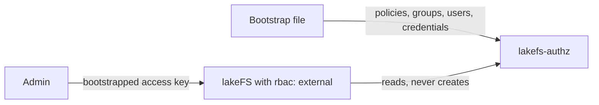

# Bootstrap file

`--bootstrap-file` (or `LAKEFS_AUTHZ_BOOTSTRAP_FILE`) names a YAML file that lakefs-authz applies at every start.
Rows are inserted only when they are missing. The file never updates or deletes anything, so a second start
reports every row as skipped.



## Example

```yaml title="bootstrap.yaml"
version: 1
policies:
  - name: FSFullAccess
    statement:
      - effect: allow
        action: ["fs:*"]
        resource: "*"
groups:
  - id: Admins
    description: lakeFS administrators
    policies: [FSFullAccess]
users:
  - username: admin
    source: internal
    email: admin@example.com
    friendly_name: Admin
    groups: [Admins]
    policies: []
    credentials:
      - access_key_id: AKIAJEXAMPLEKEY0000Q
        secret_access_key_env: LAKEFS_AUTHZ_BOOTSTRAP_ADMIN_SECRET
```

A credential secret comes from `secret_access_key` as a literal, or from the environment variable named in
`secret_access_key_env`; one of the two is required, because a generated secret could never be read back. The
file passes the same validation as the API, so it cannot create anything the API refuses.

A user that already exists is left as it is, and the groups, policies, and credentials of its entry are applied
only when the row is the same identity: its `external_id` equals the one in the file, or both are absent. A
name that an identity provider login claimed first makes the bootstrap fail with a clear error, so an entry
never decorates a stranger's account.

??? note "Pre-define a user from the identity provider"

    Give the entry the `external_id` that the provider sends as the `sub` claim:

    ```yaml
    users:
      - username: alice
        source: oidc
        external_id: 8f3c1b2e-4a5d-4c7e-9f10-2b6d8e0a1c34
        email: alice@example.com
        groups: [Admins]
    ```

    At the first login lakefs-authn looks the user up by `sub`, finds this row, and keeps the username and the
    groups you chose. Read the `sub` out of the provider first: it is an opaque id, not the email or the username.
    A wrong value leaves this row unused, and the login either creates a second user or fails with 401 because the
    username belongs to another identity.

    This is what makes `--auto-provision false` on lakefs-authn useful. Pre-define every user here, turn
    provisioning off, and no new identity provider account can claim a username that a policy names.

## Own roles instead of the lakeFS defaults

With `rbac: internal`, the lakeFS setup always creates the groups Admins, SuperUsers, Developers, and Viewers
with their policies, and it fails with 409 when one of them already exists with different content. To run
without them, switch lakeFS to `external`:

```yaml title="config.yaml"
auth:
  ui_config:
    rbac: external
```

lakeFS reads `~/.lakefs.yaml` by default, or the file you pass to `lakefs run --config`. The official image
looks in `/etc/lakefs/config.yaml`. As an environment variable the setting reads
`LAKEFS_AUTH_UI_CONFIG_RBAC=external`.

lakeFS then creates nothing: the setup endpoint does nothing, the setup wizard never appears, and the bootstrap
file is the only source of policies, groups, users, and credentials.



Two rules apply in this mode:

- The admin user and its access key must come from the bootstrap file. Nothing else creates them.
- The groups named in lakefs-authn `--initial-groups` must exist in the file. The default value is `Developers`.
