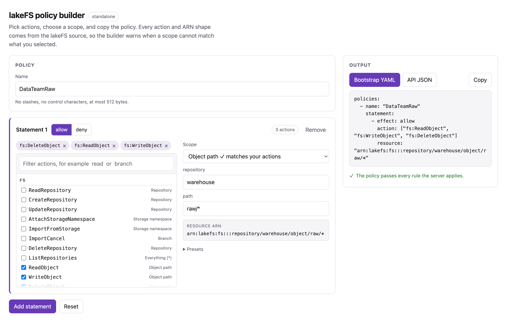
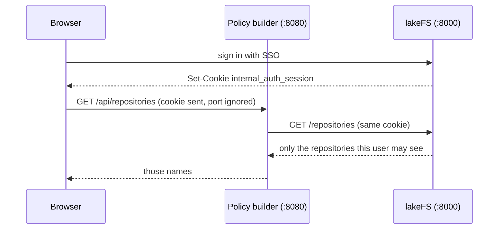

# Policy builder

Build a lakeFS policy, then copy it into a bootstrap file or into a `POST /auth/policies` call.

The builder knows every action lakeFS defines and the ARN that lakeFS checks each
action against. It warns when a statement mixes actions that lakeFS resolves to
different resources, because such a statement grants less than it looks like.

[Open the policy builder](builder.html){ .md-button .md-button--primary target=_blank }

The builder needs a wide window for its two-column layout, so it opens in its own
tab rather than inside this page. It runs entirely in the browser and needs no
server, so the link above works from the documentation alone.

[](builder.html)

## Run it against your own data

Opened from the documentation the builder is standalone: it validates what you
type, but the repository, branch, user, group, and policy fields stay free text.

`lakefs-authz` can serve the same page with live names filled in. Give it a
listener address and the lakeFS endpoint:

```sh
lakefs-authz \
  --listen 0.0.0.0:8000 \
  --builder-listen 127.0.0.1:8080 \
  --lakefs-endpoint http://lakefs:8000/api/v1
```

No credential belongs in that command, and the server stores none.

## How the builder knows who you are

The builder reuses the lakeFS session you already have. When you sign in to
lakeFS, `lakefs-authn` sets an `internal_auth_session` cookie. Cookies ignore
the port, so a browser signed in to lakeFS on `example.com:8000` also sends that
cookie to a builder on `example.com:8080`. The builder forwards the cookie to
lakeFS on every call, and lakeFS applies your own policies.

The result: the builder never shows a repository, branch, user, group, or policy
that you could not already see in lakeFS. Sign in as a different person and the
lists change.



!!! warning "Different hostnames need a cookie domain"

    The cookie travels between ports on one hostname, not between hostnames. If
    lakeFS is on `lakefs.example.com` and the builder is on
    `authz.example.com`, set `--cookie-domain .example.com` on `lakefs-authn`
    so the browser sends the cookie to both.

Without a session the page still loads and still validates, but every data route
answers `401` and the fields stay free text. The badge at the top says which
mode you are in: `standalone`, `sign in to lakeFS for live names`, or
`live as <your user name>`.

## What each caller sees

Three callers against one builder in the compose demo:

| Caller | `/api/context` | `/api/names` |
|---|---|---|
| No session | `user: null` | `401`, sign in first |
| `user`, in Developers | `user: "user"` | empty lists |
| `admin` | `user: "admin"` | 2 users, 4 groups, 10 policies |

`user` gets empty lists because lakeFS denies them `auth:ListUsers`,
`auth:ListGroups`, and `auth:ListPolicies`. The builder reports that as an empty
list rather than an error, because the names only feed autocompletion.

## Create the policy from the builder

With a live session the output panel gains a **Create in lakeFS** button. It
sends the policy to lakeFS as you, so lakeFS enforces `auth:CreatePolicy`. The
button can do nothing you could not already do in the lakeFS user interface.

The button appears only when a session is present, and stays disabled while the
policy has an error. Warnings do not block it.

What lakeFS answers is shown verbatim under the button:

| Result | What you see |
|---|---|
| Created | `Created DataTeamRaw in lakeFS.` |
| Name taken by a different policy | `lakeFS rejected the request: Already exists` |
| You lack the permission | `insufficient permissions: not allowed to auth:CreatePolicy` |

Sending the same policy twice is safe. `lakefs-authz` compares the statements
and returns the existing policy unchanged, so a repeated click does not fail and
does not alter anything. Reusing a name with *different* statements is a
conflict, and the builder says so rather than overwriting your policy.

The builder validates the policy with the same rules as the API before it calls
lakeFS, so a malformed policy never leaves the server.

!!! note "The builder never deletes or updates"

    Creating is the only write it can do. To change an existing policy, edit it
    in lakeFS or call `PUT /auth/policies/{id}` yourself.

## Add a button to the lakeFS UI

lakeFS can inject your own HTML into its interface, so the builder can be one
click away from the pages where you manage policies. It is a supported setting,
not a patch:
`ui.snippets` is a list of `{id, code}`, and lakeFS writes each `code` verbatim
into the `<!--Snippets-->` marker in the `<head>` of its `index.html`.

An environment variable cannot express a list of objects, so the snippet needs a
lakeFS configuration file:

```yaml title="config.yaml"
ui:
  snippets:
    - id: policy-builder-button
      code: |
        <script>
        (function () {
          var HREF = "http://localhost:8080";   // your builder listener
          var ID = "lakefs-policy-builder-link";
          // Only the policy pages: the list, and one policy.
          function wanted() { return location.pathname.indexOf("/auth/policies") === 0; }
          function sync() {
            var existing = document.getElementById(ID);
            if (wanted() && !existing) {
              var a = document.createElement("a");
              a.id = ID; a.href = HREF; a.target = "_blank"; a.rel = "noopener";
              a.textContent = "Open policy builder";
              a.style.cssText = "position:fixed;right:1rem;bottom:1rem;z-index:2147483647;" +
                "padding:.5rem .9rem;border-radius:999px;background:#673ab7;color:#fff;" +
                "text-decoration:none;font:600 13px/1 sans-serif";
              document.body.appendChild(a);
            }
            if (!wanted() && existing) existing.remove();
          }
          ["pushState", "replaceState"].forEach(function (name) {
            var original = history[name];
            history[name] = function () { var r = original.apply(this, arguments); sync(); return r; };
          });
          window.addEventListener("popstate", sync);
          document.addEventListener("DOMContentLoaded", sync);
          sync();
        })();
        </script>
```

Start lakeFS with `lakefs run --config /etc/lakefs/config.yaml`. Every `LAKEFS_*`
variable still wins over the file, so an existing environment-driven setup keeps
working; put only `ui.snippets` in the file.

The compose demo does exactly this; see `examples/compose/lakefs-config.yaml`.

The button appears on `/auth/policies` and on `/auth/policies/<id>`, and nowhere
else. Widen `wanted()` if you also want it on the policies attached to a user or
a group, which live under `/auth/users/<id>/policies` and
`/auth/groups/<id>/policies`.

One detail the snippet has to handle: lakeFS is a single page application, so the
route changes without a reload. The code above wraps `pushState` and
`replaceState` and listens for `popstate`. Without that the button would appear
or vanish only on a full page load.

## What the builder checks

The page applies the same rules as
[`lakefs_auth_core::validate`](https://github.com/ion-elgreco/lakefs-auth), which
is what the server applies to a bootstrap file and to the API:

- A policy needs a name and at least one statement.
- A name has no `/`, no control characters, and at most 512 bytes.
- Every action is `service:Name` with a known service.
- Every resource is `*` or an ARN whose partition is `lakefs`.

It adds two warnings that validation cannot give you, because lakeFS accepts the
policy but does not grant what you expect:

- `fs:ListObjects` scoped to an object path. lakeFS checks that action against
  the repository, so listing stays repository-wide.
- `fs:WriteObject` scoped to a branch. Only the import endpoint checks a branch
  ARN for that action; every normal upload checks the object ARN.

## Keeping the catalog current

The action list comes from `lakefs-auth-core::catalog`, which mirrors
`pkg/permissions/actions.gen.go` and `pkg/api/controller.go` in lakeFS. After a
lakeFS release adds an action, update the catalog and run:

```sh
just sync-catalog
```

Two tests fail while the page or this documentation copy is stale, so a forgotten
sync cannot reach a release.
